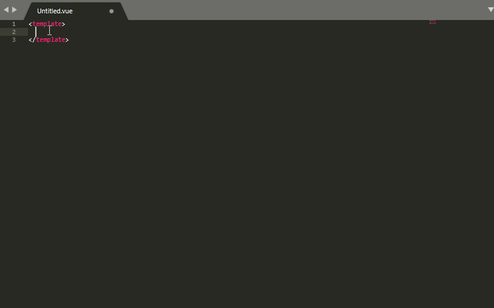

# Quasar Framework Sublime Text 3 Snippets

Sublime Text snippets for [Quasar Framework](https://quasar-framework.org/) UI components.
This plugin is ported to sublime text from [Quasar Snippets](https://github.com/Abdelaziz18003/vscode-quasar-snippets) with the aid of this [VSCode to Sublime Text snippets converter](https://github.com/bunya017/Miscellaneous/blob/master/VSCode_to_sublime.py).

### Install

* Clone this repo into your sublime `Packages` folder.
* Goto `Preferences > Settings` and add `"auto_complete_triggers": [ {"selector": "text.html.vue", "characters": "q"} ]` to the User panel.

**Note:** You must have [Vue Syntax Highlight](https://github.com/vuejs/vue-syntax-highlight) installed for this plugin to work.

### Usage

> Type the component name in lowercase letters and hit TAB
```html
qlayout + [TAB] => <q-layout view="hHr LpR lFf"></q-layout>
```



### Known Issues

- Double `<` when

### License

[MIT](http://opensource.org/licenses/MIT)